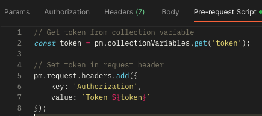
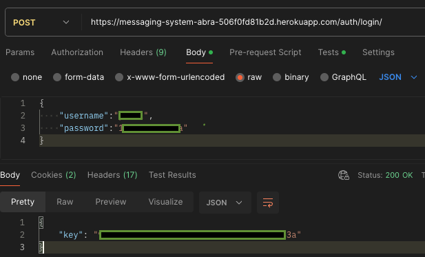
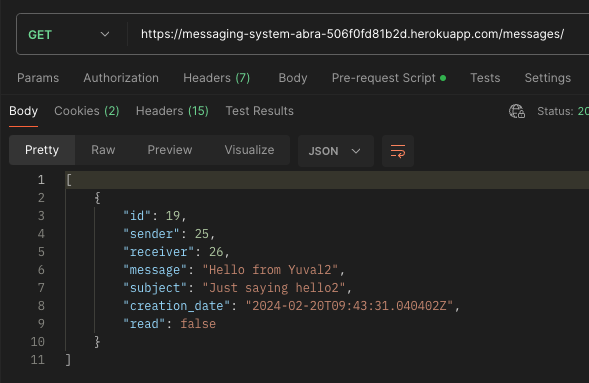
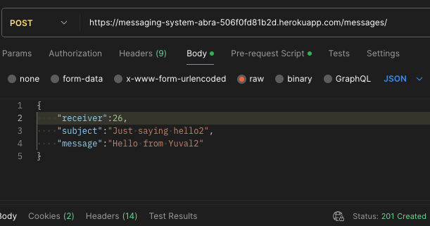
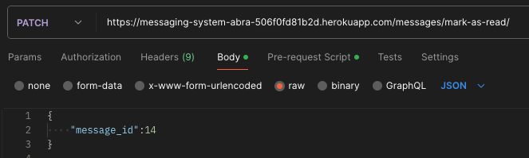
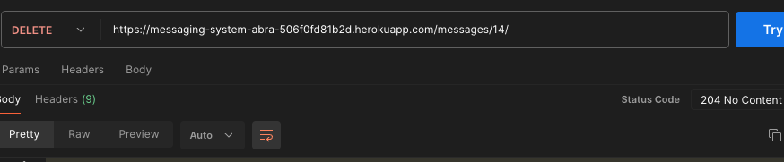

## ️⛔❗️IMPORTANT POINTS REGARDING abra ASSIGMENT❗️⛔️

1. Regarding the 'Read/Fetch message' requirement: I decided to split the logic into 2 endpoints. Instead of marking the message as 'read' as soon as it is sent back to the client, I opted to expose another endpoint for PATCH requests that acknowledge to the server that the requested message did indeed reach the client. This decision was made because I assumed that a response from the server could fail.


2. I used Token authentication. For convenience, within the Postman file, I created a Token variable to store the received token after login automatically. Additionally, I've added 'Pre-request scripts' for each request to extract the token and inject it into the headers for authorization. This is solely for the convenience of checking the assignment. Feel free to remove the scripts (though you will need to enter the token manually in order to use the endpoints).


3. All users have the same password (attached to email)


4. In this type of app, pagination is needed. I've decided not to include it since it's not in the requirements, and I didn't want to exaggerate.


5. You can find the POSTMAN examples file in the `documentation/Messaging System API.postman_collection.json`


7. If anything is unclear, I will be more than happy to clarify.


# Messaging System

A simple REST API backend system for handling messages between users.

## Table of Contents

- [IMPORTANT POINTS REGARDING ASSIGMENT](#important-points-regarding-assignment)
- [Description](#description)
- [Installation](#installation)
- [API Documentation](#api-documentation)
- [Testing](#testing)
- [Examples and Screenshots](#examples-and-screenshots)

## Description

The Messaging System is a REST API backend built to facilitate communication between users. It allows users to send,
receive, read, and delete messages, as well as retrieve all messages or unread messages for a specific user.

## Environment Configuration

In order to run the server, it's necessary to have an `.env` file configured with the appropriate environment variables. Follow these steps to set up the `.env` file:

1. **Create .env File**: Create a file named `.env` in the root directory of the project.

2. **Define Environment Variables**: Inside the `.env` file, define the required environment variables:

    ```
    # Database Configuration
    SECRET_KEY=mysecretkey
    NAME=myname
    USER_NAME=myusername
    PASSWORD=mypassword
    HOST=myhost
    ```

    Replace `mysecretkey`, `myname`, `myusername`, `mypassword`, and `myhost` with the actual values corresponding to your PostgreSQL database configuration.


3. **Security Note**: Keep the `.env` file secure and do not commit it to version control systems like Git to prevent exposing sensitive information.

You can choose to use SQLite instead of posgress. Just un-comment the relevant DB inside `settings.py`

## Installation

1. Clone the repository: `git clone https://github.com/yuvalnsn/messaging-system.git`
2. Install virtualenv if you haven't already: `pip install virtualenv`
3. Create a virtual environment: `virtualenv myenv`
4. Activate the virtual environment on windows: `myenv\Scripts\activate`
   On Unix or MacOS:`source myenv/bin/activate`
5. Install the requirements: `python -m pip install -r requirements.txt`
6. migrations?
7. Run server: `python manage.py runserver`

## API Documentation
- **BASE URL**:  `https://messaging-system-abra-506f0fd81b2d.herokuapp.com`


- **Login**: POST `/auth/login/`
    - Example request:
      ```json
      {
        "username": "username",
        "password": "password"
      }
      ```
- **Send message**: POST `/messages/`
    - Example request:
      ```json
      {
        "receiver": 3, //int
        "subject": "Just saying hello2",
        "message": "Hello from Yuval2"
      }
      ```
- **Mark message as read**: PATCH `/messages/`
    - Example request:
      ```json
      {
        "message_id": 14 //int
      }
      ```
- **Get All Messages for a Specific User**: GET `/messages/`
- **Get All Unread Messages for a Specific User**: GET `/messages/unread/:userId<int>/`
- **Retrieve Specific Message**: GET `/messages/:messageId<int>/`
- **Retrieve Last Received Message**: GET `/messages/last-received-message/`
- **Delete message**: DELETE `/messages/:<messageId>/` 

## Testing

To run tests, use the following command (make sure you're on the root path):

```bash
python manage.py test messages_app
```
#### Test Scenarios:

- **Creating a Message**: Ensures that a message can be successfully created through the API endpoint for message creation.

- **Listing Messages**: Verifies that the API endpoint for listing messages returns the expected list of messages.

- **Retrieving a Message**: Tests the retrieval of a specific message by its ID and ensures that the correct message details are returned.

- **Marking a Message as Read**: Checks whether marking a message as read updates the message status appropriately.

- **Retrieving the Last Received Message**: Verifies that the API endpoint for retrieving the last received message returns the correct message.

- **Listing Unread Messages**: Tests the API endpoint for listing unread messages to ensure it returns the expected list of unread messages.

- **Deleting a Message**: Covers scenarios related to deleting messages, including deletion by the sender and receiver, ensuring proper deletion status updates, and handling cases where a message cannot be deleted by unauthorized users.

- **Handling Nonexistent Messages**: Tests the behavior of the API when trying to delete a message that does not exist, ensuring it returns the appropriate 404 Not Found error.


##Examples and Screenshots

#### Pre-request script:
Used to extract the token from variables and inject it into the header every request




#### Endpoint: `/auth/login/`
- **HTTP Method:** POST




#### Endpoint: `/messages/`
- **HTTP Method:** GET



#### Endpoint: `/messages/`
- **HTTP Method:** POST
- Send message


#### Endpoint: `/messages/mark-as-read/`
- **HTTP Method:** PATCH
- Mark message as read




#### Endpoint: `/messages/`
- **HTTP Method:** DELETE


